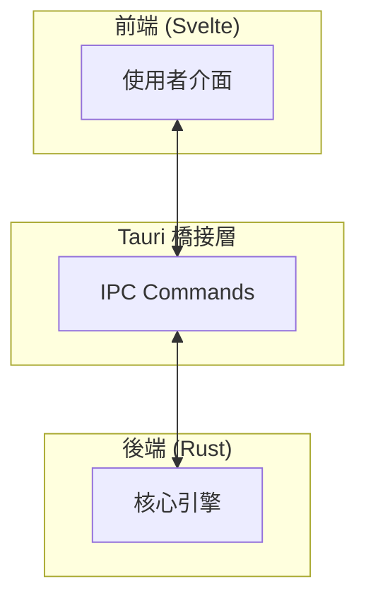

# BankFlow 金流分析器

<div align="center">

```
██████╗  █████╗ ███╗   ██╗██╗  ██╗███████╗██╗      ██████╗ ██╗    ██╗
██╔══██╗██╔══██╗████╗  ██║██║ ██╔╝██╔════╝██║     ██╔═══██╗██║    ██║
██████╔╝███████║██╔██╗ ██║█████╔╝ █████╗  ██║     ██║   ██║██║ █╗ ██║
██╔══██╗██╔══██║██║╚██╗██║██╔═██╗ ██╔══╝  ██║     ██║   ██║██║███╗██║
██████╔╝██║  ██║██║ ╚████║██║  ██╗██║     ███████╗╚██████╔╝╚███╔███╔╝
╚═════╝ ╚═╝  ╚═╝╚═╝  ╚═══╝╚═╝  ╚═╝╚═╝     ╚══════╝ ╚═════╝  ╚══╝╚══╝
                 F U N D   F L O W   A N A L Y Z E R
```

**數位鑑識金流分析系統**

_協助執法單位進行銀行交易與網銀 IP 紀錄的離線交叉比對分析_

[](https://www.rust-lang.org/)
[](https://tauri.app/)
[](https://svelte.dev/)
[](LICENSE)

[專案文件](#文件導覽) | [快速開始](#快速開始) | [下載](#下載)

</div>

---

## 專案簡介

**BankFlow 金流分析器** 是一款專為**執法單位**與**數位鑑識人員**設計的離線分析工具。透過直覺的拖曳式介面，自動清洗、整理並交叉比對「銀行存款往來明細」與「網銀 IP 登入紀錄」，協助調查人員快速識別可疑交易來源。

### 核心特色

| 特色           | 說明                                |
| -------------- | ----------------------------------- |
| **離線優先**   | 所有運算在本機完成，不上傳任何資料  |
| **高效能**     | Rust 核心引擎，處理百萬筆資料無壓力 |
| **記憶體安全** | 不產生中間暫存檔，處理完畢自動清除  |
| **OpSec 設計** | Whois 查詢需明確授權，預設關閉      |
| **直覺操作**   | 拖曳即用，零學習成本                |

### 主要功能

- **IP 交叉比對**：以 ±2 秒時間窗口比對交易時間與 IP 登入紀錄
- **收支分流**：自動將存入與支出交易分離至獨立工作表
- **敏感欄位隱藏**：可選擇隱藏特定欄位以保護個資
- **Whois 線上反查**：查詢匹配 IP 的所屬國家與 ISP 資訊
- **賽博龐克風格介面**：專業且易於操作的深色主題 UI

---

## 系統架構



### 技術堆疊

| 層級      | 技術                  | 用途              |
| --------- | --------------------- | ----------------- |
| **前端**  | Svelte 5 + TypeScript | UI 元件與狀態管理 |
| **框架**  | Tauri 2.0             | 桌面應用程式框架  |
| **後端**  | Rust                  | 核心分析引擎      |
| **Excel** | calamine + xlsxwriter | 高效 Excel 讀寫   |

---

## 快速開始

### 系統需求

| 項目         | 需求                        |
| ------------ | --------------------------- |
| **作業系統** | Windows 10/11 (64-bit)      |
| **處理器**   | Intel i3 / AMD Ryzen 3 以上 |
| **記憶體**   | 4 GB RAM 以上               |
| **硬碟空間** | 100 MB                      |

### 下載

從 [GitHub Releases](https://github.com/Birdman1972/BankFlow-Tactical-Analyzer/releases) 下載最新版本：

- **安裝版**：`BankFlow-Tactical-Analyzer_x.x.x_x64.msi`
- **可攜版**：`BankFlow-Tactical-Analyzer_x.x.x_portable.zip`

### 基本使用

1. **準備檔案**：準備存款明細 (A) 和 IP 紀錄 (B) 的 Excel 檔案
2. **拖曳上傳**：將檔案拖曳至對應的拖曳區
3. **調整設定**：依需求開啟/關閉功能選項
4. **執行分析**：點擊「執行分析」按鈕
5. **下載報告**：分析完成後下載 Excel 報告

---

## 檔案格式

### 檔案 A：存款明細

| 欄位 | 索引 | 說明     | 必要性             |
| ---- | ---- | -------- | ------------------ |
| A    | 0    | 交易時間 | 必要               |
| B    | 1    | 帳號     | 必要               |
| C    | 2    | 敏感資料 | 可隱藏             |
| F    | 5    | 敏感資料 | 可隱藏             |
| I    | 8    | 支出金額 | 必要（收支分流用） |
| J    | 9    | 存入金額 | 必要（收支分流用） |
| L    | 11   | 敏感資料 | 可隱藏             |
| M    | 12   | 敏感資料 | 可隱藏             |

### 檔案 B：IP 紀錄

| 欄位 | 索引 | 說明     | 必要性 |
| ---- | ---- | -------- | ------ |
| A    | 0    | 登入時間 | 必要   |
| B    | 1    | 帳號     | 必要   |
| C    | 2    | IP 位址  | 必要   |

---

## 文件導覽

| 文件                                   | 說明                             |
| -------------------------------------- | -------------------------------- |
| [**專案總覽**](docs/PROJECT.md)        | 完整專案說明、心智圖、功能流程圖 |
| [**系統架構**](docs/ARCHITECTURE.md)   | 詳細技術架構、模組設計、資料流程 |
| [**使用者指南**](docs/USER_GUIDE.md)   | 操作教學、介面導覽、常見問題     |
| [**技術規格**](docs/TECHNICAL_SPEC.md) | API 文件、資料結構、建構指南     |

---

## 目錄結構

```
BankFlow-Tactical-Analyzer/
├── src-tauri/              # Rust 後端
│   ├── src/
│   │   ├── commands/       # Tauri 命令
│   │   ├── core/           # 核心引擎
│   │   └── models/         # 資料模型
│   └── Cargo.toml
├── src/                    # Svelte 前端
│   ├── lib/
│   │   ├── components/     # UI 元件
│   │   └── stores/         # 狀態管理
│   └── App.svelte
├── docs/                   # 文件
│   ├── PROJECT.md
│   ├── ARCHITECTURE.md
│   ├── USER_GUIDE.md
│   └── TECHNICAL_SPEC.md
├── tests/                  # 測試
├── README.md
└── LICENSE
```

---

## 安全注意事項

### 離線操作建議

- 本工具設計為**離線分析**使用
- 若啟用 Whois 反查功能，將連線至外部 API (`ip-api.com`)
- 處理敏感案件時，建議關閉 Whois 功能或在隔離網路環境中使用

### 資料保護

- 所有資料僅在本機記憶體中處理
- 不會產生任何暫存檔案
- 分析完成後自動清除記憶體中的資料

---

## 任務管理與協作協議 (Task Management Protocol)

本專案採用的標準作業流程已完整定義於 [**Project Codex (專案法典)**](docs/CODEX.md)。以下為核心摘要：

### 1. 核心文件

| 文件            | 路徑                                | 用途                                         | 更新頻率            |
| --------------- | ----------------------------------- | -------------------------------------------- | ------------------- |
| **Task List**   | `task.md`                           | 記錄整體專案的 Todo List、當前狀態與待辦事項 | 每次任務變更時      |
| **Session Log** | `docs/sessions/YYYY-MM-DD-topic.md` | 記錄單次開發 Session 的詳細過程、決策與結果  | 每次 Session 結束前 |
| **Roadmap**     | `docs/plans/ROADMAP.md`             | 長期里程碑與版本規劃                         | 每完成一個 Phase 時 |

### 2. 開發流程 (R-P-I Loop)

所有功能實作必須遵循 `Research` -> `Plan` -> `Implement` 循環：

1.  **Research**: 確認需求、檢查現有代碼、驗證可行性。
2.  **Plan**: 更新 `task.md`，列出具體步驟 (`[ ]`)。
3.  **Implement**: 執行開發，並在完成後將 `task.md` 項目打勾 (`[x]`)。
4.  **Verify**: 驗證功能，並記錄於 Session Log。

### 3. Session 結算

每次開發 Session 結束前，必須執行：

1.  更新 `task.md` 進度。
2.  撰寫 Session Log (摘要完成事項、遇到的困難、下一步計畫)。
3.  確認 Git 狀態並提交。

---

## 開發指南

### 環境需求

- Node.js 20.x LTS
- Rust 1.75+
- pnpm 8.x+

### 本地開發

```bash
# 安裝依賴
pnpm install

# 開發模式
pnpm tauri dev

# 建構生產版本
pnpm tauri build
```

---

## 版本歷史

| 版本      | 日期       | 說明                         |
| --------- | ---------- | ---------------------------- |
| 2.0.0     | 開發中     | Tauri + Rust + Svelte 重構版 |
| 1.0.0-web | 2026-01-09 | 初始版本（Streamlit Web 版） |

---

## 授權條款

本專案採用 [MIT License](LICENSE) 授權。

## 作者

- **Antigravity AICoder**

---

<div align="center">

_專為數位鑑識打造的戰術級分析工具_

**BankFlow 金流分析器** | Made with Rust

</div>
