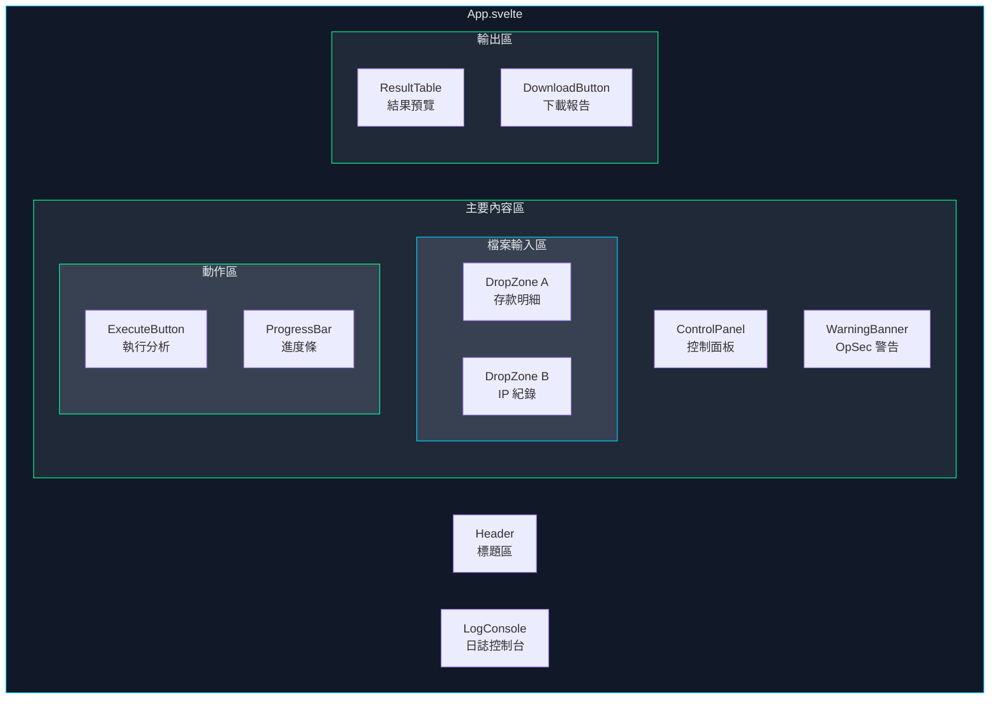
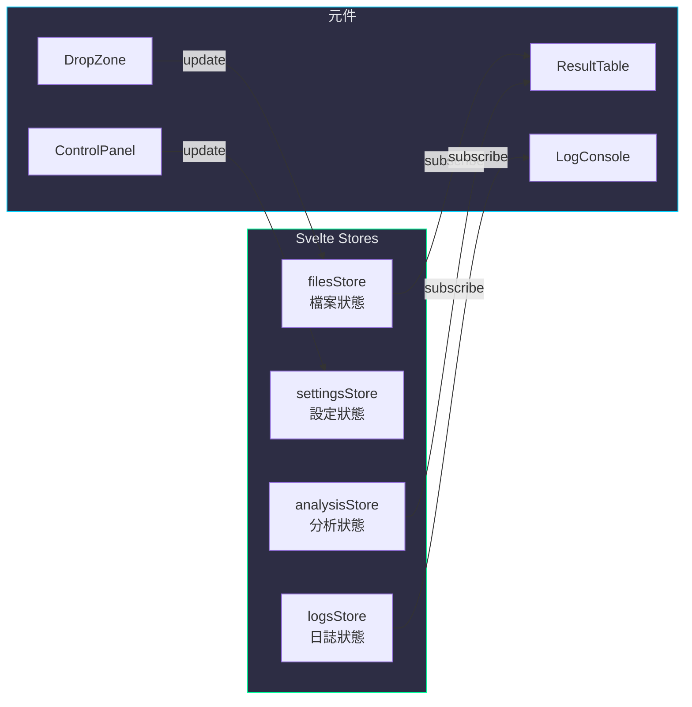
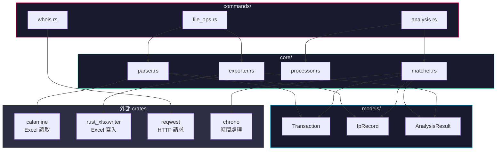
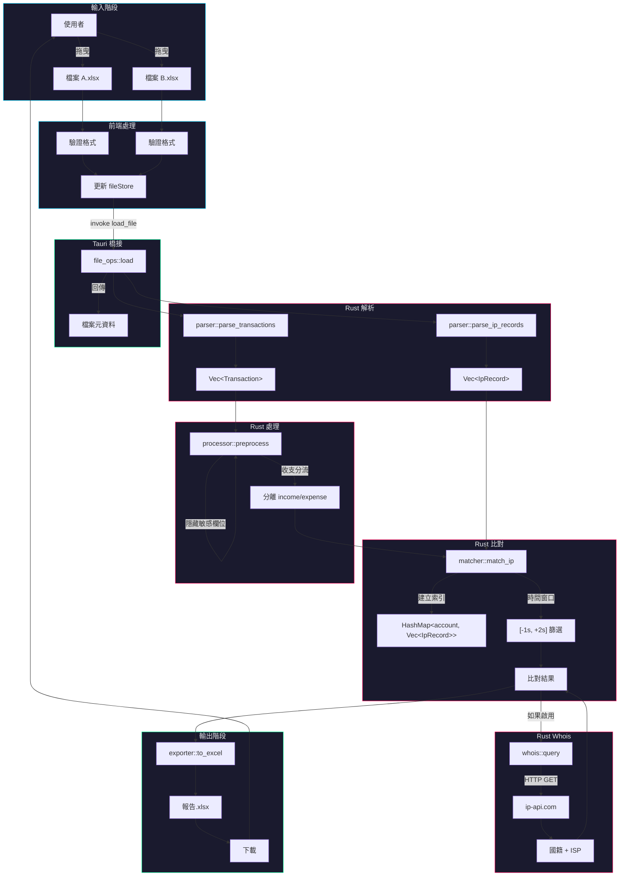
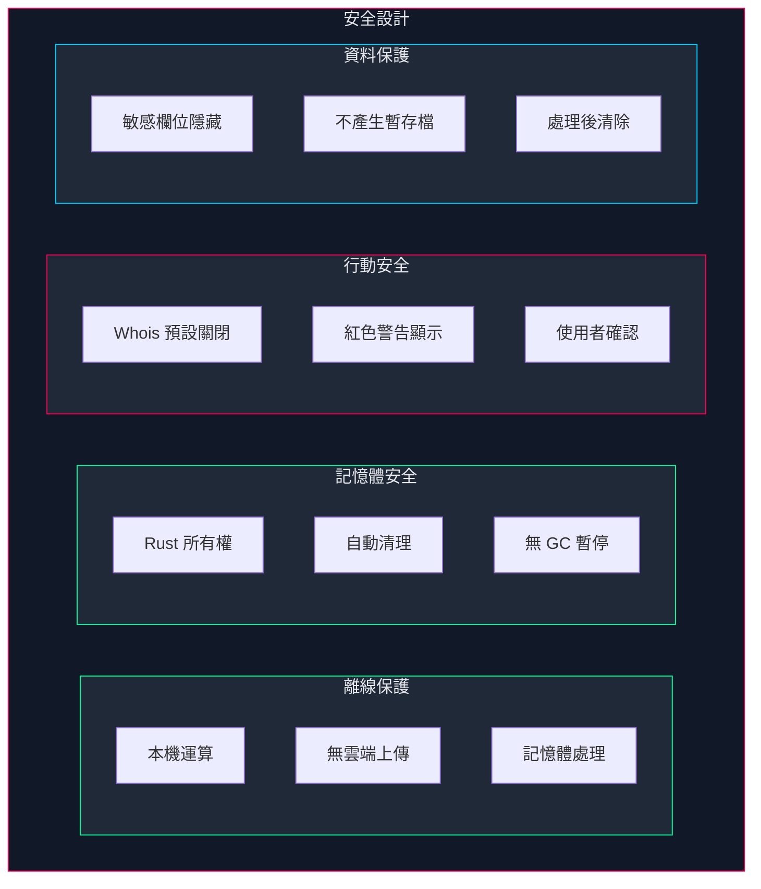

# 系統架構文件

## 目錄

- [架構總覽](#架構總覽)
- [目錄結構](#目錄結構)
- [前端架構](#前端架構)
- [後端架構](#後端架構)
- [資料流設計](#資料流設計)
- [核心演算法](#核心演算法)
- [安全設計](#安全設計)

---

## 架構總覽

### 三層式架構

```
┌──────────────────────────────────────────────────────────────────────────┐
│                                                                          │
│                         🖥️  表 現 層  (Presentation)                     │
│  ┌────────────────────────────────────────────────────────────────────┐  │
│  │                         Svelte 前端                                 │  │
│  │  ┌──────────┐  ┌──────────┐  ┌──────────┐  ┌──────────┐           │  │
│  │  │DropZone  │  │ControlPad│  │ LogPanel │  │ ResultTbl│           │  │
│  │  │ 拖曳區   │  │ 控制面板  │  │ 日誌區   │  │ 結果表格 │           │  │
│  │  └──────────┘  └──────────┘  └──────────┘  └──────────┘           │  │
│  └────────────────────────────────────────────────────────────────────┘  │
│                                    │                                     │
│                                    ▼                                     │
│                         🔗  橋 接 層  (Bridge)                           │
│  ┌────────────────────────────────────────────────────────────────────┐  │
│  │                       Tauri IPC Commands                           │  │
│  │                                                                    │  │
│  │   invoke('load_file')    invoke('analyze')    invoke('export')    │  │
│  │          │                     │                    │              │  │
│  └──────────┼─────────────────────┼────────────────────┼──────────────┘  │
│             │                     │                    │                 │
│             ▼                     ▼                    ▼                 │
│                         ⚙️  業 務 層  (Business)                         │
│  ┌────────────────────────────────────────────────────────────────────┐  │
│  │                        Rust 核心引擎                                │  │
│  │  ┌──────────┐  ┌──────────┐  ┌──────────┐  ┌──────────┐           │  │
│  │  │ Parser   │  │ Matcher  │  │ Whois    │  │ Exporter │           │  │
│  │  │ Excel解析│  │ IP比對   │  │ 網路查詢 │  │ 報告匯出 │           │  │
│  │  └──────────┘  └──────────┘  └──────────┘  └──────────┘           │  │
│  └────────────────────────────────────────────────────────────────────┘  │
│                                                                          │
└──────────────────────────────────────────────────────────────────────────┘
```

---

## 目錄結構

```
BankFlow-Tactical-Analyzer/
│
├── 📁 src-tauri/                    # Rust 後端
│   ├── 📁 src/
│   │   ├── 📄 main.rs              # Tauri 應用程式入口
│   │   ├── 📄 lib.rs               # 模組匯出與初始化
│   │   │
│   │   ├── 📁 commands/            # Tauri 命令層
│   │   │   ├── 📄 mod.rs           # 命令模組匯出
│   │   │   ├── 📄 file_ops.rs      # 檔案載入/匯出命令
│   │   │   ├── 📄 analysis.rs      # 分析執行命令
│   │   │   └── 📄 whois.rs         # Whois 查詢命令
│   │   │
│   │   ├── 📁 core/                # 核心業務邏輯
│   │   │   ├── 📄 mod.rs           # 核心模組匯出
│   │   │   ├── 📄 parser.rs        # Excel 檔案解析器
│   │   │   ├── 📄 matcher.rs       # IP 時間窗口比對引擎
│   │   │   ├── 📄 processor.rs     # 資料前處理器
│   │   │   └── 📄 exporter.rs      # Excel 報告產生器
│   │   │
│   │   ├── 📁 models/              # 資料模型
│   │   │   ├── 📄 mod.rs
│   │   │   ├── 📄 transaction.rs   # 交易資料結構
│   │   │   ├── 📄 ip_record.rs     # IP 紀錄結構
│   │   │   └── 📄 analysis.rs      # 分析結果結構
│   │   │
│   │   └── 📁 utils/               # 工具函式
│   │       ├── 📄 mod.rs
│   │       ├── 📄 datetime.rs      # 時間處理工具
│   │       └── 📄 error.rs         # 錯誤處理
│   │
│   ├── 📄 Cargo.toml               # Rust 依賴配置
│   ├── 📄 tauri.conf.json          # Tauri 應用配置
│   └── 📄 build.rs                 # 建構腳本
│
├── 📁 src/                          # Svelte 前端
│   ├── 📁 lib/
│   │   ├── 📁 components/          # UI 元件
│   │   │   ├── 📄 DropZone.svelte      # 檔案拖曳區
│   │   │   ├── 📄 ControlPanel.svelte  # 功能控制面板
│   │   │   ├── 📄 LogConsole.svelte    # 即時日誌
│   │   │   ├── 📄 ResultTable.svelte   # 結果預覽表格
│   │   │   ├── 📄 ProgressBar.svelte   # 進度條
│   │   │   └── 📄 WarningBanner.svelte # OpSec 警告橫幅
│   │   │
│   │   ├── 📁 stores/              # 狀態管理
│   │   │   ├── 📄 files.ts         # 檔案狀態
│   │   │   ├── 📄 settings.ts      # 設定狀態
│   │   │   ├── 📄 analysis.ts      # 分析結果狀態
│   │   │   └── 📄 logs.ts          # 日誌狀態
│   │   │
│   │   └── 📁 utils/               # 前端工具
│   │       ├── 📄 tauri.ts         # Tauri API 封裝
│   │       └── 📄 formatters.ts    # 格式化工具
│   │
│   ├── 📄 App.svelte               # 主應用程式元件
│   ├── 📄 main.ts                  # 前端入口點
│   └── 📄 app.css                  # 全域樣式（賽博龐克主題）
│
├── 📁 tests/                        # 測試
│   ├── 📁 fixtures/                # 測試用 Excel 檔案
│   │   ├── 📄 sample_transactions.xlsx
│   │   └── 📄 sample_ip_logs.xlsx
│   └── 📁 rust/                    # Rust 單元測試
│
├── 📁 docs/                         # 文件
│   ├── 📄 PROJECT.md               # 專案總覽
│   ├── 📄 ARCHITECTURE.md          # 架構文件（本檔案）
│   ├── 📄 USER_GUIDE.md            # 使用者指南
│   ├── 📄 TECHNICAL_SPEC.md        # 技術規格
│   └── 📁 plans/                   # 開發計畫
│
├── 📄 package.json                  # Node.js 依賴
├── 📄 vite.config.ts               # Vite 建構配置
├── 📄 svelte.config.js             # Svelte 配置
├── 📄 README.md                    # 專案說明
└── 📄 LICENSE                      # MIT 授權
```

---

## 前端架構

### 元件階層



### 狀態管理設計



---

## 後端架構

### Rust 模組關係



### 資料結構定義

```rust
// models/transaction.rs
pub struct Transaction {
    pub timestamp: DateTime<Local>,     // 交易時間
    pub account: String,                 // 帳號
    pub income: Option<f64>,             // 存入金額 (J欄)
    pub expense: Option<f64>,            // 支出金額 (I欄)
    pub raw_columns: Vec<String>,        // 原始欄位資料
    pub matched_ip: Option<String>,      // 比對結果 IP
    pub ip_country: Option<String>,      // Whois 國籍
    pub ip_isp: Option<String>,          // Whois ISP
}

// models/ip_record.rs
pub struct IpRecord {
    pub timestamp: DateTime<Local>,     // 登入時間
    pub account: String,                 // 帳號
    pub ip_address: String,              // IP 位址
}

// models/analysis.rs
pub struct AnalysisResult {
    pub summary: Vec<Transaction>,       // 總表
    pub income: Vec<Transaction>,        // 存入表
    pub expense: Vec<Transaction>,       // 支出表
    pub stats: AnalysisStats,            // 統計資訊
}

pub struct AnalysisStats {
    pub total_records: usize,            // 總筆數
    pub matched_count: usize,            // 比對成功數
    pub multi_ip_count: usize,           // 多 IP 數
    pub whois_queried: usize,            // Whois 查詢數
}
```

---

## 資料流設計

### 完整資料流程



---

## 核心演算法

### IP 時間窗口比對演算法

```
┌─────────────────────────────────────────────────────────────────────────────┐
│                        IP 時間窗口比對演算法                                  │
├─────────────────────────────────────────────────────────────────────────────┤
│                                                                             │
│  輸入：                                                                      │
│    • transactions: Vec<Transaction>  (檔案 A 的交易紀錄)                     │
│    • ip_records: Vec<IpRecord>       (檔案 B 的 IP 紀錄)                     │
│                                                                             │
│  步驟：                                                                      │
│                                                                             │
│    1. 建立 IP 紀錄索引 (O(n))                                                │
│       ┌────────────────────────────────────────────┐                        │
│       │  HashMap<String, Vec<IpRecord>>            │                        │
│       │  Key: account (帳號)                        │                        │
│       │  Value: 該帳號的所有 IP 登入紀錄            │                        │
│       └────────────────────────────────────────────┘                        │
│                                                                             │
│    2. 對每筆交易進行比對 (O(m * k))                                          │
│       ┌────────────────────────────────────────────┐                        │
│       │  for each transaction T:                   │                        │
│       │    records = index[T.account]              │                        │
│       │    matches = filter(records) where:        │                        │
│       │      T.time - 1s <= record.time <= T.time + 2s                      │
│       └────────────────────────────────────────────┘                        │
│                                                                             │
│    3. 格式化輸出                                                             │
│       ┌────────────────────────────────────────────┐                        │
│       │  無匹配     → "N/A"                         │                        │
│       │  單一 IP    → "192.168.1.1"                 │                        │
│       │  多相同 IP  → "192.168.1.1" (去重)          │                        │
│       │  多不同 IP  → "+1s:8.8.8.8 | -1s:1.1.1.1"  │                        │
│       └────────────────────────────────────────────┘                        │
│                                                                             │
│  時間複雜度：O(n + m * k)                                                    │
│    n = IP 紀錄數量                                                          │
│    m = 交易紀錄數量                                                          │
│    k = 平均每帳號的 IP 紀錄數                                                │
│                                                                             │
└─────────────────────────────────────────────────────────────────────────────┘
```

### 時間窗口視覺化

```
         交易時間 T
              │
              ▼
    ──────────●──────────────────────
              │
    ◄── -1s ──┼────── +2s ───►
              │
    ┌─────────┴─────────────────┐
    │      有效匹配區間          │
    │   [T-1秒, T, T+1秒, T+2秒] │
    └───────────────────────────┘

    範例：
    交易時間: 2024-01-15 14:30:00

    IP 登入紀錄:
    ┌──────────────────────┬────────────────┬──────────┐
    │ 登入時間             │ IP             │ 是否匹配  │
    ├──────────────────────┼────────────────┼──────────┤
    │ 14:29:58            │ 8.8.8.8        │ ❌ 超出   │
    │ 14:29:59            │ 1.1.1.1        │ ✅ -1s    │
    │ 14:30:00            │ 2.2.2.2        │ ✅ 0s     │
    │ 14:30:01            │ 3.3.3.3        │ ✅ +1s    │
    │ 14:30:02            │ 4.4.4.4        │ ✅ +2s    │
    │ 14:30:03            │ 5.5.5.5        │ ❌ 超出   │
    └──────────────────────┴────────────────┴──────────┘

    輸出: "-1s:1.1.1.1 | 0s:2.2.2.2 | +1s:3.3.3.3 | +2s:4.4.4.4"
```

---

## 安全設計

### 安全架構



### 安全檢查清單

| 類別 | 項目 | 說明 |
|------|------|------|
| **離線** | 無網路依賴 | 除 Whois 外，所有功能離線可用 |
| **記憶體** | Rust 安全 | 編譯時記憶體安全檢查 |
| **記憶體** | 自動清理 | 分析完成後自動釋放資料 |
| **OpSec** | Whois 警告 | 連線前顯示紅色警告 |
| **OpSec** | 預設關閉 | 網路功能預設不啟用 |
| **資料** | 欄位隱藏 | 可選擇移除敏感欄位 |
| **資料** | 無暫存 | 不寫入任何中間檔案 |

---

<div align="center">

*本文件為 BankFlow Tactical Analyzer 技術架構說明*

</div>
