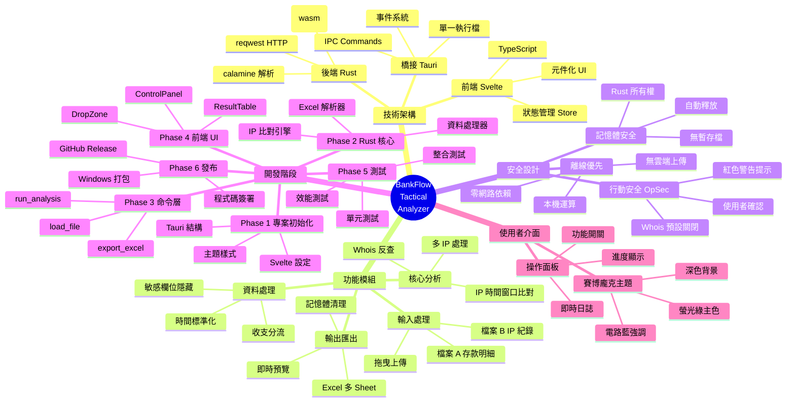
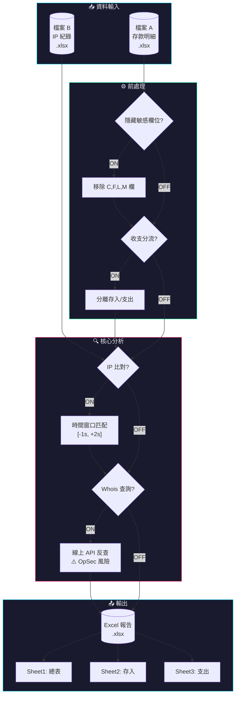
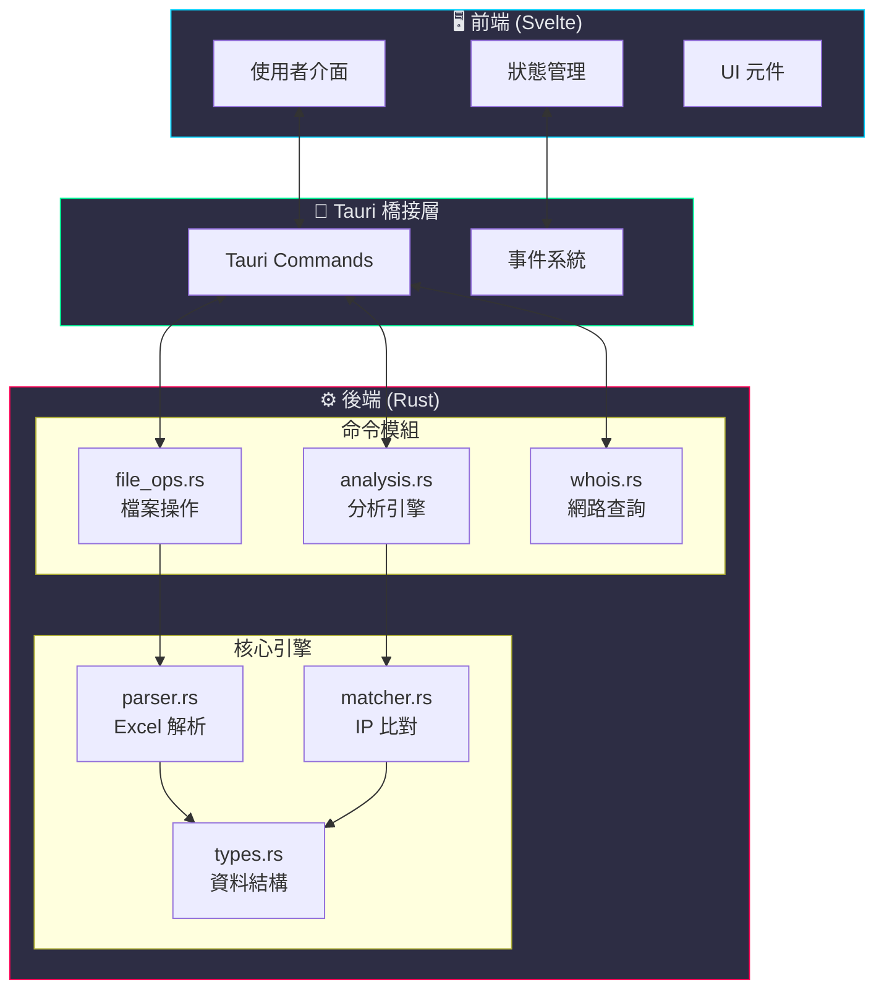
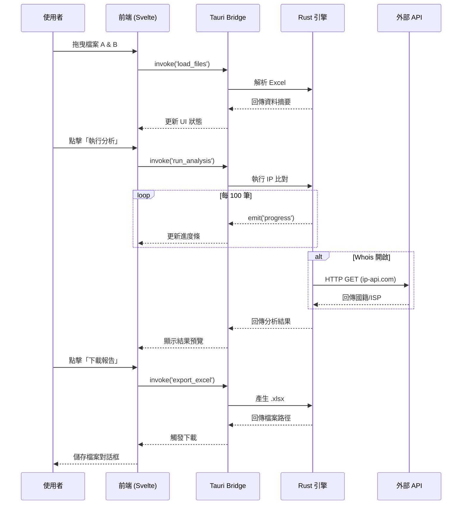

# BankFlow Tactical Analyzer

## 專案總覽

```
╔══════════════════════════════════════════════════════════════════════════════╗
║                                                                              ║
║    ██████╗  █████╗ ███╗   ██╗██╗  ██╗███████╗██╗      ██████╗ ██╗    ██╗    ║
║    ██╔══██╗██╔══██╗████╗  ██║██║ ██╔╝██╔════╝██║     ██╔═══██╗██║    ██║    ║
║    ██████╔╝███████║██╔██╗ ██║█████╔╝ █████╗  ██║     ██║   ██║██║ █╗ ██║    ║
║    ██╔══██╗██╔══██║██║╚██╗██║██╔═██╗ ██╔══╝  ██║     ██║   ██║██║███╗██║    ║
║    ██████╔╝██║  ██║██║ ╚████║██║  ██╗██║     ███████╗╚██████╔╝╚███╔███╔╝    ║
║    ╚═════╝ ╚═╝  ╚═╝╚═╝  ╚═══╝╚═╝  ╚═╝╚═╝     ╚══════╝ ╚═════╝  ╚══╝╚══╝     ║
║                                                                              ║
║                    T A C T I C A L   A N A L Y Z E R                        ║
║                        數 位 鑑 識 戰 術 分 析 系 統                          ║
║                                                                              ║
╚══════════════════════════════════════════════════════════════════════════════╝
```

---

## 目錄

- [專案簡介](#專案簡介)
- [系統心智圖](#系統心智圖)
- [核心功能](#核心功能)
- [系統架構](#系統架構)
- [技術堆疊](#技術堆疊)
- [文件導覽](#文件導覽)

---

## 專案簡介

**BankFlow Tactical Analyzer** 是一款專為**執法單位**與**數位鑑識人員**設計的離線分析工具。透過直覺的拖曳式介面，自動清洗、整理並交叉比對「銀行存款往來明細」與「網銀 IP 登入紀錄」，協助調查人員快速識別可疑交易來源。

### 設計理念

```
┌─────────────────────────────────────────────────────────────────┐
│                        核 心 原 則                               │
├─────────────────────────────────────────────────────────────────┤
│                                                                 │
│   🔒 離線優先        所有運算在本機完成，不上傳任何資料            │
│   Offline-First                                                 │
│                                                                 │
│   💾 記憶體運算      不產生中間暫存檔，處理完畢自動清除             │
│   In-Memory                                                     │
│                                                                 │
│   🛡️ 行動安全       OpSec 設計，Whois 查詢需明確授權              │
│   OpSec                                                         │
│                                                                 │
│   🎯 直覺操作        拖曳即用，零學習成本                          │
│   Intuitive                                                     │
│                                                                 │
│   ⚡ 高效能          Rust 核心引擎，處理百萬筆資料無壓力           │
│   High Performance                                              │
│                                                                 │
└─────────────────────────────────────────────────────────────────┘
```

---

## 系統心智圖



---

## 核心功能

### 功能總覽圖



### 功能詳細說明

| 功能 | 預設值 | 說明 |
|------|--------|------|
| **隱藏敏感欄位** | OFF | 移除檔案 A 的 C、F、L、M 欄（索引 2, 5, 11, 12）以保護個資 |
| **收支分流** | ON | 依據 I 欄（支出）和 J 欄（存入）將交易分離至獨立工作表 |
| **IP 交叉比對** | ON | 以時間窗口 [-1秒, +2秒] 比對交易時間與 IP 登入紀錄 |
| **Whois 線上反查** | OFF | 查詢 IP 所屬國籍與 ISP（需連線，有 OpSec 風險警告） |

---

## 系統架構

### 高階架構圖



### 資料流程圖



---

## 技術堆疊

```
┌─────────────────────────────────────────────────────────────────────────────┐
│                              技 術 堆 疊                                     │
├─────────────────────────────────────────────────────────────────────────────┤
│                                                                             │
│  ┌─────────────┐   ┌─────────────┐   ┌─────────────┐   ┌─────────────┐     │
│  │   Svelte    │   │    Tauri    │   │    Rust     │   │  Libraries  │     │
│  │             │   │             │   │             │   │             │     │
│  │  • UI 渲染  │   │  • 桌面整合 │   │  • 核心邏輯 │   │  • calamine │     │
│  │  • 狀態管理 │   │  • IPC 通訊 │   │  • 高效運算 │   │  • rust_xlsx │     │
│  │  • 元件化   │   │  • 打包發布 │   │  • 記憶體安全│  │  • reqwest  │     │
│  │             │   │             │   │             │   │  • chrono   │     │
│  └──────┬──────┘   └──────┬──────┘   └──────┬──────┘   └──────┬──────┘     │
│         │                 │                 │                 │             │
│         └─────────────────┴─────────────────┴─────────────────┘             │
│                                   │                                         │
│                                   ▼                                         │
│                    ┌─────────────────────────────┐                          │
│                    │     Windows 11 .exe         │                          │
│                    │     單一執行檔（~15MB）      │                          │
│                    └─────────────────────────────┘                          │
│                                                                             │
└─────────────────────────────────────────────────────────────────────────────┘
```

### 技術選型理由

| 層級 | 技術 | 選擇理由 |
|------|------|---------|
| **前端** | Svelte | 編譯時優化、打包體積小、元件化架構便於擴充 |
| **框架** | Tauri | 比 Electron 體積小 10 倍、原生效能、Rust 整合 |
| **後端** | Rust | 記憶體安全、高效能、適合處理大量資料 |
| **Excel** | calamine + rust_xlsxwriter (wasm) | Rust 原生、讀寫效能優異 |

---

## 文件導覽

| 文件 | 說明 |
|------|------|
| [📖 ARCHITECTURE.md](./ARCHITECTURE.md) | 詳細系統架構與模組說明 |
| [📘 USER_GUIDE.md](./USER_GUIDE.md) | 使用者操作指南 |
| [📗 TECHNICAL_SPEC.md](./TECHNICAL_SPEC.md) | 技術規格與 API 文件 |
| [📋 plans/](./plans/) | 開發計畫與設計文件 |

---

<div align="center">

**版本**：2.0.0-tauri | **技術架構**：Tauri + Rust + Svelte

*專為數位鑑識打造的戰術級分析工具*

</div>
