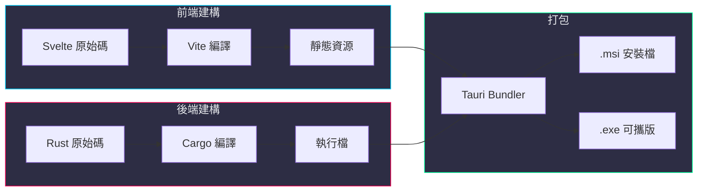
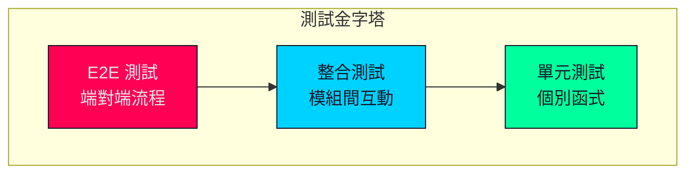

# 技術規格文件

## 目錄

- [技術堆疊](#技術堆疊)
- [環境需求](#環境需求)
- [建構指南](#建構指南)
- [API 文件](#api-文件)
- [資料結構](#資料結構)
- [效能規格](#效能規格)
- [測試規格](#測試規格)

---

## 技術堆疊

### 核心技術

```
┌─────────────────────────────────────────────────────────────────────────────┐
│                              技 術 堆 疊 明 細                               │
├─────────────────────────────────────────────────────────────────────────────┤
│                                                                             │
│  前端 (Frontend)                                                            │
│  ┌─────────────────────────────────────────────────────────────────────┐   │
│  │  Svelte          5.x      元件化 UI 框架                             │   │
│  │  TypeScript      5.x      型別安全的 JavaScript                      │   │
│  │  Vite            5.x      快速建構工具                                │   │
│  │  TailwindCSS     3.x      實用優先的 CSS 框架                         │   │
│  └─────────────────────────────────────────────────────────────────────┘   │
│                                                                             │
│  後端 (Backend)                                                             │
│  ┌─────────────────────────────────────────────────────────────────────┐   │
│  │  Rust            1.75+    系統程式語言                                │   │
│  │  Tauri           2.x      桌面應用框架                                │   │
│  │  Tokio           1.x      非同步執行時                                │   │
│  └─────────────────────────────────────────────────────────────────────┘   │
│                                                                             │
│  Rust Crates                                                                │
│  ┌─────────────────────────────────────────────────────────────────────┐   │
│  │  calamine        0.24+    Excel 讀取 (.xlsx/.xls)                    │   │
│  │  rust_xlsxwriter 0.64+    Excel 寫入 (.xlsx)                         │   │
│  │  chrono          0.4+     日期時間處理                                │   │
│  │  reqwest         0.11+    HTTP 客戶端                                 │   │
│  │  serde           1.x      序列化/反序列化                             │   │
│  │  serde_json      1.x      JSON 處理                                   │   │
│  │  thiserror       1.x      錯誤處理                                    │   │
│  │  rayon           1.x      平行運算                                    │   │
│  └─────────────────────────────────────────────────────────────────────┘   │
│                                                                             │
└─────────────────────────────────────────────────────────────────────────────┘
```

### Cargo.toml 依賴

```toml
[package]
name = "bankflow-tactical-analyzer"
version = "2.0.0"
edition = "2021"
authors = ["Antigravity AICoder"]
description = "數位鑑識戰術分析系統"

[dependencies]
# Tauri 框架
tauri = { version = "2", features = ["shell-open"] }
tauri-plugin-dialog = "2"
tauri-plugin-fs = "2"

# 非同步執行時
tokio = { version = "1", features = ["full"] }

# Excel 處理
calamine = "0.24"
rust_xlsxwriter = "0.64"

# 時間處理
chrono = { version = "0.4", features = ["serde"] }

# HTTP 請求
reqwest = { version = "0.11", features = ["json", "blocking"] }

# 序列化
serde = { version = "1", features = ["derive"] }
serde_json = "1"

# 錯誤處理
thiserror = "1"
anyhow = "1"

# 平行運算
rayon = "1"

# 日誌
log = "0.4"
env_logger = "0.10"

[build-dependencies]
tauri-build = { version = "2", features = [] }

[features]
default = ["custom-protocol"]
custom-protocol = ["tauri/custom-protocol"]
```

### package.json 依賴

```json
{
  "name": "bankflow-tactical-analyzer",
  "version": "2.0.0",
  "type": "module",
  "scripts": {
    "dev": "vite",
    "build": "vite build",
    "preview": "vite preview",
    "tauri": "tauri"
  },
  "devDependencies": {
    "@sveltejs/vite-plugin-svelte": "^3.0.0",
    "@tauri-apps/cli": "^2.0.0",
    "@tsconfig/svelte": "^5.0.0",
    "autoprefixer": "^10.4.0",
    "postcss": "^8.4.0",
    "svelte": "^5.0.0",
    "svelte-check": "^3.0.0",
    "tailwindcss": "^3.4.0",
    "typescript": "^5.0.0",
    "vite": "^5.0.0"
  },
  "dependencies": {
    "@tauri-apps/api": "^2.0.0"
  }
}
```

---

## 環境需求

### 開發環境

| 工具 | 版本 | 用途 |
|------|------|------|
| **Node.js** | 20.x LTS | 前端建構 |
| **pnpm** | 8.x+ | 套件管理器 |
| **Rust** | 1.75+ | 後端編譯 |
| **VS Code** | Latest | IDE（建議） |

### Rust 工具鏈

```bash
# 安裝 Rust
curl --proto '=https' --tlsv1.2 -sSf https://sh.rustup.rs | sh

# 安裝 Windows 目標（跨平台編譯用）
rustup target add x86_64-pc-windows-msvc

# 確認版本
rustc --version  # >= 1.75.0
cargo --version  # >= 1.75.0
```

### Windows 建構需求

```
Visual Studio Build Tools 2022
  └── MSVC v143 - VS 2022 C++ x64/x86 建構工具
  └── Windows 11 SDK (10.0.22621.0)
  └── C++ CMake 工具
```

---

## 建構指南

### 開發模式

```bash
# 1. 安裝前端依賴
pnpm install

# 2. 啟動開發伺服器
pnpm tauri dev
```

### 生產建構

```bash
# Windows 安裝檔 (.msi)
pnpm tauri build

# 輸出位置：
# src-tauri/target/release/bundle/msi/*.msi
```

### 建構流程圖



---

## API 文件

### Tauri Commands

#### `load_file`

載入 Excel 檔案並解析。

```typescript
// 前端呼叫
import { invoke } from '@tauri-apps/api/core';

interface FileMetadata {
  path: string;
  row_count: number;
  columns: string[];
  file_type: 'transactions' | 'ip_records';
}

const metadata = await invoke<FileMetadata>('load_file', {
  path: '/path/to/file.xlsx',
  fileType: 'transactions'
});
```

```rust
// 後端實作
#[tauri::command]
async fn load_file(
    path: String,
    file_type: String,
    state: State<'_, AppState>
) -> Result<FileMetadata, String> {
    // ...
}
```

---

#### `run_analysis`

執行分析並回傳結果。

```typescript
// 前端呼叫
interface AnalysisOptions {
  hide_sensitive: boolean;
  split_income_expense: boolean;
  ip_matching: boolean;
  whois_lookup: boolean;
}

interface AnalysisResult {
  summary: Transaction[];
  income: Transaction[];
  expense: Transaction[];
  stats: AnalysisStats;
}

const result = await invoke<AnalysisResult>('run_analysis', {
  options: {
    hide_sensitive: false,
    split_income_expense: true,
    ip_matching: true,
    whois_lookup: false
  }
});
```

```rust
// 後端實作
#[tauri::command]
async fn run_analysis(
    options: AnalysisOptions,
    state: State<'_, AppState>
) -> Result<AnalysisResult, String> {
    // ...
}
```

---

#### `export_excel`

產生 Excel 報告並回傳檔案路徑。

```typescript
// 前端呼叫
const filePath = await invoke<string>('export_excel', {
  outputPath: '/path/to/output.xlsx'
});
```

```rust
// 後端實作
#[tauri::command]
async fn export_excel(
    output_path: String,
    state: State<'_, AppState>
) -> Result<String, String> {
    // ...
}
```

---

### 事件系統

#### `analysis_progress`

分析進度更新事件。

```typescript
// 前端監聽
import { listen } from '@tauri-apps/api/event';

interface ProgressPayload {
  stage: string;
  current: number;
  total: number;
  percentage: number;
}

await listen<ProgressPayload>('analysis_progress', (event) => {
  console.log(`進度: ${event.payload.percentage}%`);
});
```

```rust
// 後端發送
app_handle.emit("analysis_progress", ProgressPayload {
    stage: "IP 比對中".to_string(),
    current: 500,
    total: 1000,
    percentage: 50,
})?;
```

---

## 資料結構

### TypeScript 型別定義

```typescript
// src/lib/types.ts

/** 交易紀錄 */
export interface Transaction {
  /** 交易時間 */
  timestamp: string;
  /** 帳號 */
  account: string;
  /** 存入金額 */
  income: number | null;
  /** 支出金額 */
  expense: number | null;
  /** 原始欄位資料 */
  raw_columns: string[];
  /** 比對結果 IP */
  matched_ip: string | null;
  /** IP 國籍 */
  ip_country: string | null;
  /** IP ISP */
  ip_isp: string | null;
}

/** IP 登入紀錄 */
export interface IpRecord {
  /** 登入時間 */
  timestamp: string;
  /** 帳號 */
  account: string;
  /** IP 位址 */
  ip_address: string;
}

/** 分析結果 */
export interface AnalysisResult {
  /** 總表 */
  summary: Transaction[];
  /** 存入交易 */
  income: Transaction[];
  /** 支出交易 */
  expense: Transaction[];
  /** 統計資訊 */
  stats: AnalysisStats;
}

/** 分析統計 */
export interface AnalysisStats {
  /** 總筆數 */
  total_records: number;
  /** 比對成功數 */
  matched_count: number;
  /** 多 IP 數 */
  multi_ip_count: number;
  /** Whois 查詢數 */
  whois_queried: number;
}

/** 分析選項 */
export interface AnalysisOptions {
  /** 隱藏敏感欄位 */
  hide_sensitive: boolean;
  /** 收支分流 */
  split_income_expense: boolean;
  /** IP 比對 */
  ip_matching: boolean;
  /** Whois 查詢 */
  whois_lookup: boolean;
}
```

### Rust 型別定義

```rust
// src-tauri/src/models/mod.rs

use chrono::{DateTime, Local};
use serde::{Deserialize, Serialize};

/// 交易紀錄
#[derive(Debug, Clone, Serialize, Deserialize)]
pub struct Transaction {
    pub timestamp: DateTime<Local>,
    pub account: String,
    pub income: Option<f64>,
    pub expense: Option<f64>,
    pub raw_columns: Vec<String>,
    pub matched_ip: Option<String>,
    pub ip_country: Option<String>,
    pub ip_isp: Option<String>,
}

/// IP 登入紀錄
#[derive(Debug, Clone, Serialize, Deserialize)]
pub struct IpRecord {
    pub timestamp: DateTime<Local>,
    pub account: String,
    pub ip_address: String,
}

/// 分析結果
#[derive(Debug, Clone, Serialize, Deserialize)]
pub struct AnalysisResult {
    pub summary: Vec<Transaction>,
    pub income: Vec<Transaction>,
    pub expense: Vec<Transaction>,
    pub stats: AnalysisStats,
}

/// 分析統計
#[derive(Debug, Clone, Serialize, Deserialize)]
pub struct AnalysisStats {
    pub total_records: usize,
    pub matched_count: usize,
    pub multi_ip_count: usize,
    pub whois_queried: usize,
}

/// 分析選項
#[derive(Debug, Clone, Serialize, Deserialize)]
pub struct AnalysisOptions {
    pub hide_sensitive: bool,
    pub split_income_expense: bool,
    pub ip_matching: bool,
    pub whois_lookup: bool,
}
```

---

## 效能規格

### 效能目標

| 指標 | 目標值 | 測量條件 |
|------|--------|---------|
| **檔案載入** | < 2 秒 | 10 萬筆資料 |
| **IP 比對** | < 5 秒 | 10 萬筆交易 × 50 萬筆 IP |
| **Excel 匯出** | < 3 秒 | 10 萬筆資料 |
| **記憶體使用** | < 500 MB | 10 萬筆資料處理中 |
| **啟動時間** | < 1 秒 | 冷啟動 |

### 效能最佳化策略

```
┌─────────────────────────────────────────────────────────────────────────────┐
│                              效 能 最 佳 化                                  │
├─────────────────────────────────────────────────────────────────────────────┤
│                                                                             │
│  1. IP 比對索引                                                              │
│  ────────────────                                                           │
│  使用 HashMap<account, Vec<IpRecord>> 建立索引                               │
│  將 O(n×m) 降至 O(n×k)，k = 平均每帳號紀錄數                                 │
│                                                                             │
│  2. 平行運算                                                                 │
│  ────────────                                                               │
│  使用 Rayon 平行處理：                                                       │
│  • 檔案解析（多執行緒讀取）                                                  │
│  • IP 比對（平行迭代）                                                       │
│  • Whois 查詢（批次並行）                                                    │
│                                                                             │
│  3. 記憶體管理                                                               │
│  ────────────                                                               │
│  • 串流式 Excel 寫入（不載入整個檔案至記憶體）                               │
│  • 即時釋放不再使用的資料                                                    │
│  • 避免不必要的複製（使用引用）                                              │
│                                                                             │
│  4. 快取策略                                                                 │
│  ────────────                                                               │
│  • Whois 結果快取（相同 IP 不重複查詢）                                       │
│  • 解析結果快取（避免重複解析相同檔案）                                       │
│                                                                             │
└─────────────────────────────────────────────────────────────────────────────┘
```

---

## 測試規格

### 測試類型



### 單元測試範例

```rust
// tests/rust/matcher_test.rs

#[cfg(test)]
mod tests {
    use super::*;
    use chrono::TimeZone;

    #[test]
    fn test_ip_matching_single_match() {
        let transaction = Transaction {
            timestamp: Local.with_ymd_and_hms(2024, 1, 15, 14, 30, 0).unwrap(),
            account: "1234567890".to_string(),
            ..Default::default()
        };

        let ip_records = vec![
            IpRecord {
                timestamp: Local.with_ymd_and_hms(2024, 1, 15, 14, 30, 1).unwrap(),
                account: "1234567890".to_string(),
                ip_address: "203.145.67.89".to_string(),
            }
        ];

        let result = match_ip(&transaction, &ip_records);
        assert_eq!(result, Some("203.145.67.89".to_string()));
    }

    #[test]
    fn test_ip_matching_no_match() {
        let transaction = Transaction {
            timestamp: Local.with_ymd_and_hms(2024, 1, 15, 14, 30, 0).unwrap(),
            account: "1234567890".to_string(),
            ..Default::default()
        };

        let ip_records = vec![
            IpRecord {
                timestamp: Local.with_ymd_and_hms(2024, 1, 15, 14, 30, 5).unwrap(), // 超出窗口
                account: "1234567890".to_string(),
                ip_address: "203.145.67.89".to_string(),
            }
        ];

        let result = match_ip(&transaction, &ip_records);
        assert_eq!(result, None);
    }

    #[test]
    fn test_ip_matching_multiple_different_ips() {
        let transaction = Transaction {
            timestamp: Local.with_ymd_and_hms(2024, 1, 15, 14, 30, 0).unwrap(),
            account: "1234567890".to_string(),
            ..Default::default()
        };

        let ip_records = vec![
            IpRecord {
                timestamp: Local.with_ymd_and_hms(2024, 1, 15, 14, 29, 59).unwrap(),
                account: "1234567890".to_string(),
                ip_address: "1.1.1.1".to_string(),
            },
            IpRecord {
                timestamp: Local.with_ymd_and_hms(2024, 1, 15, 14, 30, 2).unwrap(),
                account: "1234567890".to_string(),
                ip_address: "8.8.8.8".to_string(),
            }
        ];

        let result = match_ip(&transaction, &ip_records);
        assert!(result.is_some());
        let result_str = result.unwrap();
        assert!(result_str.contains("1.1.1.1"));
        assert!(result_str.contains("8.8.8.8"));
    }
}
```

### 測試資料產生器

```rust
// tests/fixtures/generator.rs

/// 產生測試用交易資料
pub fn generate_test_transactions(count: usize) -> Vec<Transaction> {
    (0..count)
        .map(|i| Transaction {
            timestamp: Local::now() - Duration::seconds(i as i64),
            account: format!("{:010}", i % 1000),
            income: if i % 2 == 0 { Some((i * 1000) as f64) } else { None },
            expense: if i % 2 == 1 { Some((i * 500) as f64) } else { None },
            ..Default::default()
        })
        .collect()
}

/// 產生測試用 IP 紀錄
pub fn generate_test_ip_records(count: usize) -> Vec<IpRecord> {
    (0..count)
        .map(|i| IpRecord {
            timestamp: Local::now() - Duration::seconds(i as i64),
            account: format!("{:010}", i % 1000),
            ip_address: format!("{}.{}.{}.{}",
                (i % 256),
                ((i / 256) % 256),
                ((i / 65536) % 256),
                ((i / 16777216) % 256)
            ),
        })
        .collect()
}
```

---

## UI 設計規格

### 配色方案

```css
/* 賽博龐克配色 */
:root {
  /* 背景色 */
  --bg-primary: #111827;      /* 深灰藍 */
  --bg-secondary: #1F2937;    /* 次要背景 */
  --bg-tertiary: #374151;     /* 第三層背景 */

  /* 主色調 */
  --color-primary: #00FF9D;   /* 螢光綠 - 成功/動作 */
  --color-accent: #00D2FF;    /* 電路藍 - 強調 */
  --color-warning: #FF0055;   /* 霓虹紅 - 警告 */

  /* 文字色 */
  --text-primary: #E5E7EB;    /* 主要文字 */
  --text-secondary: #9CA3AF;  /* 次要文字 */
  --text-muted: #6B7280;      /* 淡化文字 */

  /* 邊框 */
  --border-color: #374151;
  --border-glow: rgba(0, 210, 255, 0.5);
}
```

### 視窗規格

| 屬性 | 值 |
|------|-----|
| **預設寬度** | 1000px |
| **預設高度** | 800px |
| **最小寬度** | 800px |
| **最小高度** | 600px |
| **可調整大小** | 是 |
| **標題列** | 自定義 |

---

<div align="center">

*BankFlow 金流分析器 技術規格文件 v2.0.0*

</div>
