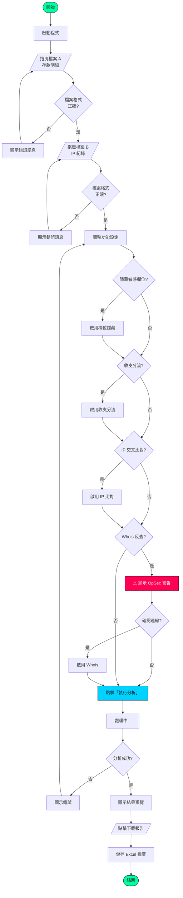

# 使用者指南

## 目錄

- [快速開始](#快速開始)
- [系統需求](#系統需求)
- [安裝步驟](#安裝步驟)
- [介面導覽](#介面導覽)
- [操作流程](#操作流程)
- [檔案格式說明](#檔案格式說明)
- [功能詳解](#功能詳解)
- [常見問題](#常見問題)

---

## 快速開始

### 三分鐘上手流程

```
┌─────────────────────────────────────────────────────────────────────────────┐
│                                                                             │
│     ① 準備檔案          ② 拖曳上傳          ③ 執行分析          ④ 下載報告   │
│                                                                             │
│    ┌─────────┐        ┌─────────┐        ┌─────────┐        ┌─────────┐    │
│    │ 📄 A.xlsx│   ──►  │ 拖曳區 A │   ──►  │ 🚀 執行 │   ──►  │ 💾 下載 │    │
│    │ 📄 B.xlsx│        │ 拖曳區 B │        │   分析   │        │   報告   │    │
│    └─────────┘        └─────────┘        └─────────┘        └─────────┘    │
│                                                                             │
│    存款明細 +           載入兩個            點擊按鈕            取得 Excel   │
│    IP 紀錄              Excel 檔案          開始分析            分析結果     │
│                                                                             │
└─────────────────────────────────────────────────────────────────────────────┘
```

---

## 系統需求

| 項目 | 最低需求 | 建議配置 |
|------|---------|---------|
| **作業系統** | Windows 10 (64-bit) | Windows 11 |
| **處理器** | Intel i3 / AMD Ryzen 3 | Intel i5 / AMD Ryzen 5 以上 |
| **記憶體** | 4 GB RAM | 8 GB RAM 以上 |
| **硬碟空間** | 100 MB | 500 MB |
| **螢幕解析度** | 1280 x 720 | 1920 x 1080 |

---

## 安裝步驟

### Windows 安裝

```
步驟 1：下載執行檔
────────────────────────────────────────
    從 GitHub Releases 下載最新版本：
    BankFlow-Tactical-Analyzer_x.x.x_x64.msi

步驟 2：執行安裝程式
────────────────────────────────────────
    雙擊 .msi 檔案，依照提示完成安裝

步驟 3：啟動應用程式
────────────────────────────────────────
    從開始選單或桌面捷徑啟動程式
```

### 可攜版（免安裝）

```
步驟 1：下載壓縮檔
────────────────────────────────────────
    下載 BankFlow-Tactical-Analyzer_x.x.x_portable.zip

步驟 2：解壓縮
────────────────────────────────────────
    解壓縮至任意資料夾

步驟 3：執行
────────────────────────────────────────
    雙擊 BankFlow-Tactical-Analyzer.exe
```

---

## 介面導覽

### 主畫面配置

```
┌──────────────────────────────────────────────────────────────────────────────┐
│  ┌────────────────────────────────────────────────────────────────────────┐  │
│  │                    🏦 BankFlow 金流分析器                              │  │
│  │                      數位鑑識金流分析系統                               │  │
│  └────────────────────────────────────────────────────────────────────────┘  │
│                                    ①  標題區                                 │
├────────────────────────────────────┬─────────────────────────────────────────┤
│                                    │                                         │
│  ┌──────────────────────────────┐  │  ┌──────────────────────────────────┐   │
│  │                              │  │  │                                  │   │
│  │     📂 檔案 A (存款明細)     │  │  │      📂 檔案 B (IP 紀錄)        │   │
│  │                              │  │  │                                  │   │
│  │     拖曳 Excel 檔案至此      │  │  │      拖曳 Excel 檔案至此         │   │
│  │     或點擊選擇檔案           │  │  │      或點擊選擇檔案              │   │
│  │                              │  │  │                                  │   │
│  └──────────────────────────────┘  │  └──────────────────────────────────┘   │
│                                    │                                         │
│                        ②  檔案輸入區（拖曳區）                               │
├──────────────────────────────────────────────────────────────────────────────┤
│  ┌────────────────────────────────────────────────────────────────────────┐  │
│  │  ⚙️ 控制面板                                                           │  │
│  │                                                                        │  │
│  │  ┌─────────────────┐  ┌─────────────────┐  ┌─────────────────┐        │  │
│  │  │ 🔘 隱藏敏感欄位 │  │ 🔘 收支分流     │  │ 🔘 IP 交叉比對  │        │  │
│  │  │    [OFF]        │  │    [ON]         │  │    [ON]         │        │  │
│  │  └─────────────────┘  └─────────────────┘  └─────────────────┘        │  │
│  │                                                                        │  │
│  │  ┌─────────────────────────────────────────────────────────────────┐  │  │
│  │  │ ⚠️ Whois 線上反查 [OFF]                                         │  │  │
│  │  │ 警告：此操作將連線至外部 API（OpSec 風險）                        │  │  │
│  │  └─────────────────────────────────────────────────────────────────┘  │  │
│  └────────────────────────────────────────────────────────────────────────┘  │
│                                    ③  控制面板                               │
├──────────────────────────────────────────────────────────────────────────────┤
│  ┌────────────────────────────────────────────────────────────────────────┐  │
│  │                                                                        │  │
│  │                      🚀  E X E C U T E   A N A L Y S I S               │  │
│  │                              執 行 分 析                               │  │
│  │                                                                        │  │
│  └────────────────────────────────────────────────────────────────────────┘  │
│                                    ④  執行按鈕                               │
├──────────────────────────────────────────────────────────────────────────────┤
│  ┌────────────────────────────────────────────────────────────────────────┐  │
│  │  📊 結果預覽                                                           │  │
│  │  ┌──────────┬──────────┬──────────┬──────────┬──────────┬──────────┐  │  │
│  │  │ 時間     │ 帳號     │ 金額     │ 類型     │ IP       │ 國籍     │  │  │
│  │  ├──────────┼──────────┼──────────┼──────────┼──────────┼──────────┤  │  │
│  │  │ ...      │ ...      │ ...      │ ...      │ ...      │ ...      │  │  │
│  │  └──────────┴──────────┴──────────┴──────────┴──────────┴──────────┘  │  │
│  │                                                                        │  │
│  │  ┌─────────────────────────────────────────────────────────────────┐  │  │
│  │  │                    💾 下載分析報告 (.xlsx)                       │  │  │
│  │  └─────────────────────────────────────────────────────────────────┘  │  │
│  └────────────────────────────────────────────────────────────────────────┘  │
│                                    ⑤  結果區                                 │
├──────────────────────────────────────────────────────────────────────────────┤
│  ┌────────────────────────────────────────────────────────────────────────┐  │
│  │  📋 系統日誌                                                           │  │
│  │  ──────────────────────────────────────────────────────────────────── │  │
│  │  [14:30:01] ✅ 檔案 A 載入成功 (1,234 筆)                              │  │
│  │  [14:30:02] ✅ 檔案 B 載入成功 (5,678 筆)                              │  │
│  │  [14:30:03] 🔄 正在執行 IP 比對...                                     │  │
│  │  [14:30:15] ✅ IP 比對完成 (匹配 892 筆)                               │  │
│  │  [14:30:16] ✅ 分析完成！                                              │  │
│  └────────────────────────────────────────────────────────────────────────┘  │
│                                    ⑥  日誌區                                 │
└──────────────────────────────────────────────────────────────────────────────┘
```

---

## 操作流程

### 完整操作流程圖



### 步驟詳解

#### 步驟 1：載入檔案

```
┌─────────────────────────────────────────────────────────────────┐
│                                                                 │
│   方法 A：拖曳上傳                                               │
│   ─────────────────                                             │
│   直接將 Excel 檔案拖曳至對應的拖曳區                            │
│                                                                 │
│   方法 B：點擊選擇                                               │
│   ─────────────────                                             │
│   點擊拖曳區，開啟檔案選擇對話框                                  │
│                                                                 │
│   ✅ 成功載入後：                                                │
│   • 拖曳區顯示綠色打勾圖示                                       │
│   • 日誌區顯示載入成功訊息與筆數                                  │
│                                                                 │
│   ❌ 載入失敗：                                                  │
│   • 拖曳區顯示紅色錯誤圖示                                       │
│   • 日誌區顯示錯誤原因                                           │
│                                                                 │
└─────────────────────────────────────────────────────────────────┘
```

#### 步驟 2：調整設定

```
┌─────────────────────────────────────────────────────────────────┐
│                                                                 │
│   功能開關說明：                                                 │
│                                                                 │
│   🔘 隱藏敏感欄位 [預設: OFF]                                    │
│   ───────────────────────────                                   │
│   開啟後，報告中將移除以下欄位：                                  │
│   • C 欄 (索引 2)                                                │
│   • F 欄 (索引 5)                                                │
│   • L 欄 (索引 11)                                               │
│   • M 欄 (索引 12)                                               │
│                                                                 │
│   🔘 收支分流 [預設: ON]                                         │
│   ─────────────────────                                         │
│   開啟後，報告將產生三個工作表：                                  │
│   • Sheet1: 總表                                                 │
│   • Sheet2: 存入交易 (J 欄 > 0)                                  │
│   • Sheet3: 支出交易 (I 欄 > 0)                                  │
│                                                                 │
│   🔘 IP 交叉比對 [預設: ON]                                      │
│   ─────────────────────────                                     │
│   開啟後，將以時間窗口比對 IP：                                   │
│   • 時間範圍：交易時間 ±1~2 秒                                   │
│   • 匹配條件：相同帳號                                           │
│                                                                 │
│   ⚠️ Whois 線上反查 [預設: OFF]                                  │
│   ────────────────────────────                                  │
│   開啟後，將查詢 IP 的國籍與 ISP                                  │
│   ⚠️ 注意：此功能需要網路連線，有 OpSec 風險                     │
│                                                                 │
└─────────────────────────────────────────────────────────────────┘
```

#### 步驟 3：執行分析

```
┌─────────────────────────────────────────────────────────────────┐
│                                                                 │
│   點擊「執行分析」按鈕後：                                       │
│                                                                 │
│   1. 進度條顯示處理進度                                          │
│   2. 日誌區即時更新處理狀態                                       │
│   3. 處理完成後顯示結果預覽                                       │
│                                                                 │
│   處理階段：                                                     │
│   ┌──────────────────────────────────────────────────┐          │
│   │  [████████████████████░░░░░░░░░░]  65%           │          │
│   │                                                  │          │
│   │  階段 1: 資料前處理      ✅ 完成                  │          │
│   │  階段 2: IP 比對中...    🔄 進行中               │          │
│   │  階段 3: Whois 查詢      ⏳ 等待中               │          │
│   │  階段 4: 產生報告        ⏳ 等待中               │          │
│   └──────────────────────────────────────────────────┘          │
│                                                                 │
└─────────────────────────────────────────────────────────────────┘
```

#### 步驟 4：下載報告

```
┌─────────────────────────────────────────────────────────────────┐
│                                                                 │
│   分析完成後：                                                   │
│                                                                 │
│   1. 查看結果預覽表格（前 10 筆）                                 │
│   2. 確認資料正確性                                              │
│   3. 點擊「下載分析報告」按鈕                                    │
│   4. 選擇儲存位置與檔名                                          │
│                                                                 │
│   報告內容：                                                     │
│   ┌──────────────────────────────────────────────────┐          │
│   │  📊 Analysis_Result_20240115_143000.xlsx         │          │
│   │                                                  │          │
│   │  ├── Sheet1_Summary (總表)                       │          │
│   │  │   └── 包含 IP 比對結果與 Whois 資訊           │          │
│   │  │                                               │          │
│   │  ├── Sheet2_Income (存入)                        │          │
│   │  │   └── J 欄 > 0 的交易                         │          │
│   │  │                                               │          │
│   │  └── Sheet3_Expense (支出)                       │          │
│   │       └── I 欄 > 0 的交易                        │          │
│   └──────────────────────────────────────────────────┘          │
│                                                                 │
└─────────────────────────────────────────────────────────────────┘
```

---

## 檔案格式說明

### 檔案 A：存款明細格式

```
┌─────────────────────────────────────────────────────────────────────────────┐
│                           檔案 A 欄位對照表                                  │
├─────────┬──────────┬─────────────┬───────────────────────────────────────────┤
│  欄位   │  索引    │  必要性     │  說明                                     │
├─────────┼──────────┼─────────────┼───────────────────────────────────────────┤
│  A 欄   │  0       │  ✅ 必要    │  交易時間 (YYYY-MM-DD HH:MM:SS)           │
│  B 欄   │  1       │  ✅ 必要    │  帳號                                     │
│  C 欄   │  2       │  ⚠️ 敏感    │  可隱藏 - 依需求定義                      │
│  D 欄   │  3       │  選用      │  交易說明                                  │
│  E 欄   │  4       │  選用      │  交易代碼                                  │
│  F 欄   │  5       │  ⚠️ 敏感    │  可隱藏 - 依需求定義                      │
│  G 欄   │  6       │  選用      │  其他資訊                                  │
│  H 欄   │  7       │  選用      │  其他資訊                                  │
│  I 欄   │  8       │  ✅ 必要    │  支出金額（收支分流用）                    │
│  J 欄   │  9       │  ✅ 必要    │  存入金額（收支分流用）                    │
│  K 欄   │  10      │  選用      │  其他資訊                                  │
│  L 欄   │  11      │  ⚠️ 敏感    │  可隱藏 - 依需求定義                      │
│  M 欄   │  12      │  ⚠️ 敏感    │  可隱藏 - 依需求定義                      │
└─────────┴──────────┴─────────────┴───────────────────────────────────────────┘

範例資料：
┌────────────────────┬────────────┬──────────┬──────────┐
│ A (時間)           │ B (帳號)   │ I (支出) │ J (存入) │
├────────────────────┼────────────┼──────────┼──────────┤
│ 2024-01-15 14:30:00│ 1234567890 │    0     │  50000   │
│ 2024-01-15 15:45:23│ 1234567890 │  10000   │    0     │
│ 2024-01-15 16:00:01│ 0987654321 │    0     │  25000   │
└────────────────────┴────────────┴──────────┴──────────┘
```

### 檔案 B：IP 紀錄格式

```
┌─────────────────────────────────────────────────────────────────────────────┐
│                           檔案 B 欄位對照表                                  │
├─────────┬──────────┬─────────────┬───────────────────────────────────────────┤
│  欄位   │  索引    │  必要性     │  說明                                     │
├─────────┼──────────┼─────────────┼───────────────────────────────────────────┤
│  A 欄   │  0       │  ✅ 必要    │  登入時間 (YYYY-MM-DD HH:MM:SS)           │
│  B 欄   │  1       │  ✅ 必要    │  帳號                                     │
│  C 欄   │  2       │  ✅ 必要    │  IP 位址                                  │
└─────────┴──────────┴─────────────┴───────────────────────────────────────────┘

範例資料：
┌────────────────────┬────────────┬─────────────────┐
│ A (登入時間)       │ B (帳號)   │ C (IP 位址)     │
├────────────────────┼────────────┼─────────────────┤
│ 2024-01-15 14:29:59│ 1234567890 │ 203.145.67.89   │
│ 2024-01-15 14:30:01│ 1234567890 │ 203.145.67.89   │
│ 2024-01-15 16:00:00│ 0987654321 │ 61.220.45.123   │
└────────────────────┴────────────┴─────────────────┘
```

---

## 功能詳解

### IP 比對結果說明

```
┌─────────────────────────────────────────────────────────────────────────────┐
│                           IP 比對結果格式說明                                │
├─────────────────────────────────────────────────────────────────────────────┤
│                                                                             │
│  情況 1：無匹配                                                              │
│  ─────────────────                                                          │
│  結果顯示：N/A                                                               │
│  說明：在時間窗口內找不到相同帳號的 IP 紀錄                                   │
│                                                                             │
│  情況 2：單一 IP 匹配                                                        │
│  ───────────────────                                                        │
│  結果顯示：203.145.67.89                                                     │
│  說明：時間窗口內只有一個 IP（可能多筆但 IP 相同）                            │
│                                                                             │
│  情況 3：多個不同 IP 匹配                                                    │
│  ─────────────────────                                                      │
│  結果顯示：-1s:203.145.67.89 | +2s:61.220.45.123                             │
│  說明：時間窗口內有多個不同 IP，顯示各自的時間差                              │
│                                                                             │
│  時間差說明：                                                                │
│  • -1s = 比交易時間早 1 秒                                                   │
│  • 0s  = 與交易時間相同                                                      │
│  • +1s = 比交易時間晚 1 秒                                                   │
│  • +2s = 比交易時間晚 2 秒                                                   │
│                                                                             │
└─────────────────────────────────────────────────────────────────────────────┘
```

### Whois 查詢結果

```
┌─────────────────────────────────────────────────────────────────────────────┐
│                           Whois 查詢結果說明                                 │
├─────────────────────────────────────────────────────────────────────────────┤
│                                                                             │
│  新增欄位：                                                                  │
│  ┌──────────────┬─────────────────────────────────────────────────────────┐ │
│  │  IP_Country  │  IP 所屬國籍（例：Taiwan, China, United States）        │ │
│  ├──────────────┼─────────────────────────────────────────────────────────┤ │
│  │  IP_ISP      │  網路服務提供者（例：Chunghwa Telecom, China Mobile）   │ │
│  └──────────────┴─────────────────────────────────────────────────────────┘ │
│                                                                             │
│  ⚠️ OpSec 注意事項：                                                        │
│  • 此功能需連線至 ip-api.com API                                             │
│  • 查詢行為可能被記錄                                                        │
│  • 處理敏感案件時，建議在隔離網路環境中使用                                   │
│  • 或完全關閉此功能，改用離線資料庫                                          │
│                                                                             │
└─────────────────────────────────────────────────────────────────────────────┘
```

---

## 常見問題

### Q1：檔案載入失敗怎麼辦？

```
✅ 檢查清單：
  □ 檔案格式是否為 .xlsx 或 .xls
  □ 檔案是否正在被其他程式開啟
  □ 檔案是否損毀（嘗試用 Excel 開啟）
  □ 時間欄位格式是否正確
```

### Q2：IP 比對結果都是 N/A？

```
✅ 可能原因：
  □ 檔案 A 和檔案 B 的帳號格式不一致
  □ 時間格式不一致（需要精確到秒）
  □ 時間差超過比對窗口（-1秒 ~ +2秒）
  □ 檔案 B 缺少對應的 IP 紀錄
```

### Q3：處理大檔案時很慢？

```
✅ 效能建議：
  □ 關閉不需要的功能（如 Whois）
  □ 確保電腦有足夠記憶體
  □ 關閉其他佔用資源的程式
  □ 考慮分批處理大型資料
```

### Q4：Whois 查詢失敗？

```
✅ 檢查清單：
  □ 確認網路連線正常
  □ 確認未被防火牆阻擋
  □ API 可能有請求限制，稍後重試
  □ 某些內網 IP 無法查詢
```

---

<div align="center">

*如有其他問題，請參閱 [GitHub Issues](https://github.com/Birdman1972/BankFlow-Tactical-Analyzer/issues)*

</div>
