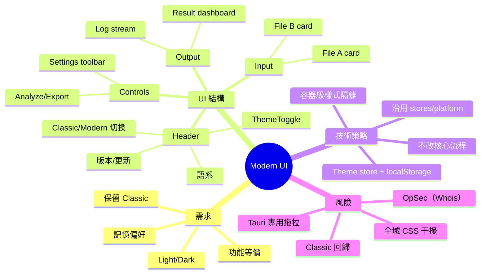

# Modern UI（保留 Classic + 新增 Light/Dark）設計文件

建立日期：2026-01-27

## 背景與目標

本專案目前的主頁面（Classic）是賽博龐克深色風格，承載完整的分析流程（檔案 A/B → 設定 → 分析 → 結果 → 匯出 + 日誌/進度）。

本文件定義一個「新增 Modern 頁面」的方案：
- Classic 必須完整保留（視覺與行為不回歸）。
- Modern 必須功能等價（需求與 Classic 一致），但提供可切換的 Light / Dark，並記憶使用者偏好。

## 功能等價（Modern 與 Classic 必須一致）

- 檔案輸入
  - 檔案 A（存款明細）與檔案 B（IP 紀錄）
  - 選檔：沿用 platform actions（桌面/網頁皆可）
  - 拖拉：僅 Tauri 平台可用（沿用既有 dynamic import 行為）
- 設定（AnalysisSettings）
  - 隱藏敏感欄位
  - 收支分流
  - IP 比對
  - Whois（預設關閉；需維持 OpSec 提示/流程）
- 分析與匯出
  - 執行分析、顯示進度、顯示結果摘要
  - 匯出 Excel 報告
- 其他
  - 多語系切換（沿用 i18n）
  - 清除全部（清除 fileA/fileB/analysisResult 等）
  - 即時日誌（沿用 logs/addLog）
  - 更新提醒（UpdateDialog）與 Toast（如現況有）

## 非目標（這次不做）

- 不重構核心引擎（bankflow-core）與平台抽象（platform.ts）的既有行為。
- 不把 Classic 強制改成支援 Light/Dark。
- 不新增大型 UI framework 依賴。

## 現況盤點（與本方案相關）

- 主頁面：`src/App.svelte` 目前直接 render 分析 UI（未真正用 router 做頁面切換）。
- Router store：`src/lib/stores/router.ts` 定義 `PageId = 'home' | 'about' | 'feedback'`；Sidebar 元件已存在但未整合到 App。
- Tailwind：`tailwind.config.js` 未設定 `darkMode`。
- Global CSS：`src/app.css` 是 Classic 的深色基調（:root/body + cyber/neon utility classes）。

## 設計決策

### UI 模式切換（Classic / Modern）

採用「最小改動、低風險」整合方式：

- App 層新增一個 UI 模式切換（Classic/Modern）。
- Classic 區塊保持原樣（最好搬到 `ClassicPage.svelte` 作為純包裝，避免後續維護互相干擾）。
- Modern 放在獨立頁面（`ModernPage.svelte`）與獨立元件命名空間（例如 `src/lib/components/modern/**`）。

備註：Router/Sidebar 可在 Modern 穩定後再逐步啟用；避免一開始把「路由整合」跟「新 UI/主題」綁在一起造成回歸。

### Modern 的 Light/Dark 策略

優先採用「容器級主題」來隔離 Classic 的全域深色背景：

- 建立 `theme` store：`'light' | 'dark'`，存 `localStorage`（例如 key：`bf.theme`）。
- ModernPage 根容器依 theme 套用 class（例如：
  - light：`bg-slate-50 text-slate-900`
  - dark：`bg-slate-900 text-slate-100`
  ）
- Modern 的卡片/分隔線/文字階層全用 Tailwind utility 形成一致語意。

可選擇性決策（後續再做）：
- 是否啟用 Tailwind `darkMode: 'class'` 以使用 `dark:` variants。
  - 這會影響整個 Tailwind 產物；如果要上，需確保 Classic 不受影響（Classic 仍以現有 cyber/neon class 為主）。

## 架構圖（Modern 只換 UI，不換核心流程）

```mermaid
flowchart TB
  subgraph UI[Frontend: Svelte]
    App[App.svelte\n(UI Mode Switch)]
    Classic[ClassicPage (現有 UI)]
    Modern[ModernPage (新 UI)]
    Theme[theme store\n(light|dark)]
    I18n[i18n store]
    Stores[app stores\n(fileA/fileB/settings/logs/progress/result)]
    Platform[platform abstraction\n(src/lib/stores/platform.ts)]
  end

  subgraph Desktop[Tauri]
    TauriImpl[tauri-impl.ts + commands]
  end

  subgraph Web[Web/WASM]
    WasmImpl[wasm-impl.ts + wasm pkg]
  end

  subgraph Core[Rust core]
    CoreEngine[crates/bankflow-core]
  end

  App -->|render| Classic
  App -->|render| Modern
  Modern <-->|toggle| Theme
  Classic <-->|use| I18n
  Modern <-->|use| I18n

  Classic <-->|read/write| Stores
  Modern <-->|read/write| Stores
  Stores --> Platform

  Platform -->|desktop| TauriImpl
  Platform -->|web| WasmImpl

  TauriImpl --> CoreEngine
  WasmImpl --> CoreEngine
```

## 流程圖 A：分析主流程（兩個頁面一致）

```mermaid
flowchart TD
  A[選擇/拖入 檔案 A] --> B[選擇/拖入 檔案 B]
  B --> C[調整設定\n(hide/split/ip/whois)]
  C --> D[執行分析]
  D --> E{平台}
  E -->|Tauri| F[invoke run_analysis + 進度事件]
  E -->|Web/WASM| G[呼叫 wasm 分析]
  F --> H[分析完成\nanalysisResult set]
  G --> H
  H --> I[顯示結果摘要]
  I --> J[匯出報告]
  J --> K{平台}
  K -->|Tauri| L[invoke export_excel]
  K -->|Web/WASM| M[WASM export + 下載]
```

## 流程圖 B：主題切換（僅 Modern）

```mermaid
flowchart TD
  S[App/Modern 初始化] --> R[讀 localStorage: bf.theme]
  R -->|有值| A[套用 light/dark]
  R -->|無值| D[預設: dark 或 light\n(由產品決策)]
  A --> U[使用者切換 ThemeToggle]
  D --> U
  U --> P[更新 theme store]
  P --> W[寫回 localStorage]
  P --> C[更新 Modern 容器 class]
```

## 心智圖（Modern UI 交付範圍）



## 實作分期（先文件、後功能）

1. 文件補齊（本文件）
2. 新增 `theme` store 與 ThemeToggle（只影響 Modern）
3. 建立 ModernPage 與 modern 元件（FileCard/SettingsToolbar/LogPanel/ResultDashboard）
4. App 整合：Classic/Modern 切換（Classic 原樣保留）
5. 回歸驗收：桌面/網頁、WASM build、核心 tests

## 驗收清單

- Classic 完全不變：UI 與流程皆一致（手動操作 smoke test）
- Modern 功能等價：A/B 載入、設定、分析、匯出、日誌、進度
- Modern light/dark 可切換且重啟保留
- Tauri 專屬拖拉只在 Tauri 啟用；Web 顯示合理的 fallback
- Whois 維持明確同意/警告流程
