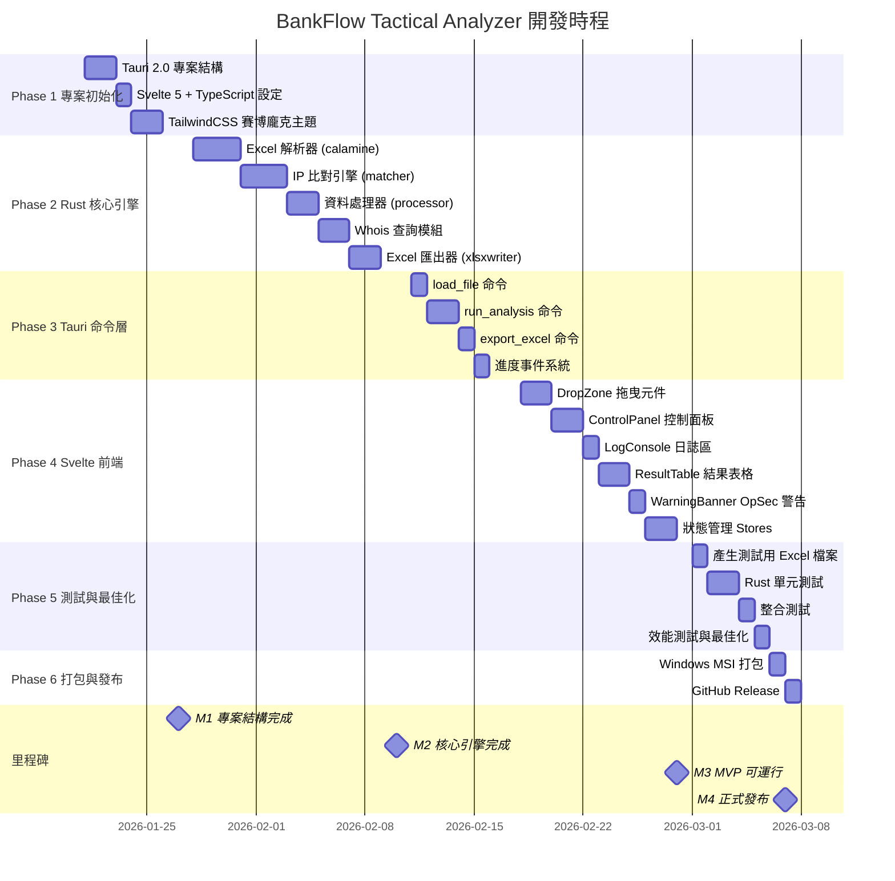

# BankFlow Tactical Analyzer - 開發時程

**建立日期**：2026-01-21
**預計完成**：2026-03-07
**總工期**：7 週

---

## 時程總覽

---

## 里程碑定義

| 里程碑 | 日期 | 驗收標準 |
|--------|------|----------|
| **M1** 專案結構完成 | 2026-01-27 | Tauri + Svelte 專案可編譯啟動 |
| **M2** 核心引擎完成 | 2026-02-10 | Rust 模組通過單元測試 |
| **M3** MVP 可運行 | 2026-02-28 | 端對端流程可執行（拖曳→分析→匯出） |
| **M4** 正式發布 | 2026-03-07 | Windows 執行檔發布至 GitHub |

---

## 階段詳細任務

### Phase 1：專案初始化 (01/21 - 01/27) ✅

- [x] 建立 Tauri 2.0 專案結構
- [x] 設定 Svelte 5 + TypeScript + Vite
- [x] 設定 TailwindCSS（賽博龐克主題）
- [x] 建立基本目錄結構
- [x] 驗證專案可編譯啟動

### Phase 2：Rust 核心引擎 (01/28 - 02/10) ✅

- [x] 實作 Excel 解析器（calamine）
  - [x] Transaction 結構解析
  - [x] IpRecord 結構解析
  - [x] 時間格式處理
- [x] 實作 IP 比對引擎
  - [x] 建立帳號索引 HashMap
  - [x] 時間窗口比對邏輯
  - [x] 結果格式化
- [x] 實作資料處理器
  - [x] 敏感欄位過濾
  - [x] 收支分流邏輯
- [x] 實作 Whois 查詢（reqwest）
- [x] 實作 Excel 匯出器（rust_xlsxwriter）

### Phase 3：Tauri 命令層 (02/11 - 02/17) ✅

- [x] 實作 `load_file` 命令
- [x] 實作 `load_ip_file` 命令
- [x] 實作 `run_analysis` 命令
- [x] 實作 `export_excel` 命令
- [x] 實作進度事件發送 (analysis-progress event)
- [x] 設定 App State 管理
- [x] 實作 `query_whois` / `query_whois_batch` 命令

### Phase 4：Svelte 前端 (02/18 - 02/28) ✅

- [x] 實作 DropZone（檔案拖曳區）
- [x] 實作 ControlPanel（控制面板）
- [x] 實作 LogConsole（日誌區）
- [x] 實作 ResultSummary（結果摘要）
- [x] 實作 WarningBanner（OpSec 警告）
- [x] 實作狀態管理 Stores (app.ts, tauri.ts)
- [x] 實作賽博龐克主題 CSS
- [x] 整合 App.svelte 主頁面

### Phase 5：測試與最佳化 (03/01 - 03/05)

- [ ] 產生測試用 Excel 檔案
- [ ] 撰寫 Rust 單元測試
- [ ] 撰寫整合測試
- [ ] 效能測試與最佳化
- [ ] 記憶體使用測試

### Phase 6：打包與發布 (03/06 - 03/07)

- [ ] Windows MSI 打包設定
- [ ] 可攜版 ZIP 打包
- [ ] 撰寫發布說明
- [ ] GitHub Release 發布

---

## 風險緩衝

| 風險項目 | 緩衝時間 | 說明 |
|----------|----------|------|
| Rust 學習曲線 | +2 天 | Phase 2 預留 |
| Windows 打包問題 | +1 天 | Phase 6 預留 |
| 整合測試問題 | +2 天 | Phase 5 預留 |

---

## 進度追蹤

| 階段 | 狀態 | 完成度 | 備註 |
|------|------|--------|------|
| Phase 1 | ✅ 完成 | 100% | 2026-01-21 完成 |
| Phase 2 | ✅ 完成 | 100% | 2026-01-21 完成 |
| Phase 3 | ✅ 完成 | 100% | 2026-01-21 完成 |
| Phase 4 | ✅ 完成 | 100% | 2026-01-21 完成 |
| Phase 5 | 🔜 進行中 | 0% | - |
| Phase 6 | ⏳ 等待中 | 0% | - |

---

*此時程規劃將隨開發進度更新*
